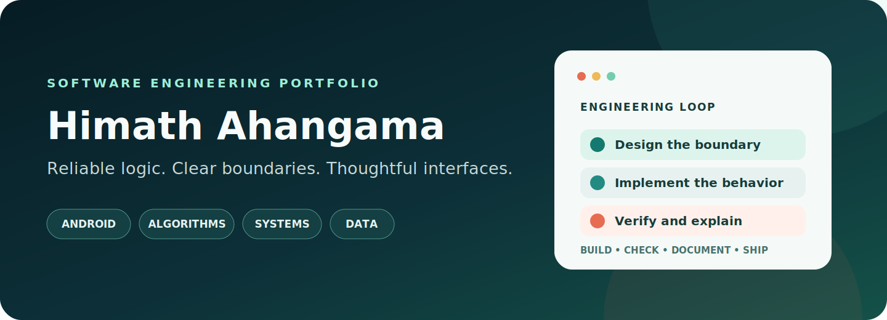
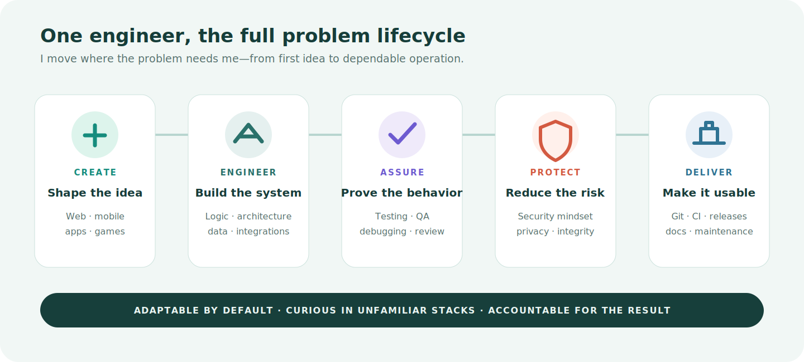

  

  
  
  

## Hello, I’m Himath

I’m a Software Engineering undergraduate who enjoys solving the whole problem—not only writing the first version of the code.

I can move from requirements and architecture into implementation, data, debugging, testing, security-aware review, automation, and delivery. I’m deliberately building range across web, mobile, applications, games, systems, databases, quality engineering, and cybersecurity because useful engineers need to understand how the pieces affect one another.

**No single technology defines me. Clear thinking, dependable execution, and the ability to learn the next one do.**

  

## Where I add value

| Situation | How I approach it |
| --- | --- |
| **An idea needs a first working system** | Clarify the real requirement, model the solution, build the smallest complete path, and leave a foundation another engineer can understand. |
| **Existing software is failing or difficult to change** | Reproduce the problem, trace causes rather than symptoms, protect existing behavior, and refactor only where the payoff is clear. |
| **Quality needs to become intentional** | Turn expected behavior into checks, cover edge cases and failure paths, improve testability, and make QA evidence visible. |
| **Data or security carries risk** | Define trust boundaries, validate inputs, protect integrity and privacy, review dependencies, and prefer secure defaults. |
| **Working code needs to become a deliverable** | Use clean Git history, focused CI, reproducible setup, practical documentation, release notes, and honest limitations. |
| **The stack is unfamiliar** | Learn from first principles, read the system before changing it, verify assumptions early, and adapt without pretending certainty. |

## Engineering toolbox

  
  
  
  
  
  

  
  
  
  
  
  

## The standard I work toward

- **Understand before changing.** Read the behavior, constraints, and failure modes before reaching for a rewrite.
- **Design visible boundaries.** Keep interface, domain logic, data, integrations, and infrastructure understandable.
- **Make quality observable.** Use tests, static analysis, CI, and reproducible commands to replace “it should work” with evidence.
- **Treat security as engineering.** Validate inputs, minimize exposure, protect data integrity, and keep dependencies reviewable.
- **Document the real system.** Explain setup, decisions, trade-offs, and limitations that actually exist in the implementation.
- **Finish professionally.** A solution is not complete until someone else can inspect, run, maintain, and trust it.

## Always expanding the range

The repositories pinned below are evidence of this approach in different problem spaces—not the boundary of what I can do. More web, application, game, quality, security, data, and systems work will join them as it is ready to be reviewed professionally.

  <a href="https://github.com/Himath2002?tab=repositories"><strong>Explore the repositories →</strong></a>

