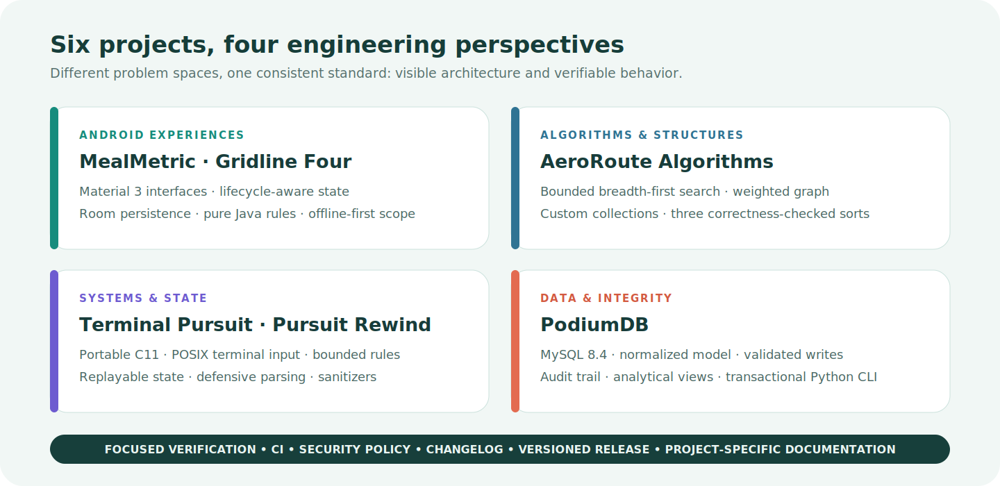

  

  
  
  

## Hello, I’m Himath

I’m a Software Engineering undergraduate interested in the point where correct logic, maintainable structure, and thoughtful user experience meet. This profile documents six projects across Android, algorithms, systems programming, and relational data engineering.

Each repository is presented as an engineering case study: the scope is explicit, the setup is reproducible, the architecture is visible, and the claims are backed by focused verification.

  

## Selected work

| Project | Engineering focus | Evidence you can inspect |
| --- | --- | --- |
| [MealMetric Android](https://github.com/Himath2002/mealmetric-android) | Privacy-minded meal journal with Java, Room, Retrofit, Material 3, and a complete offline path | Lifecycle-aware state, repository boundary, local-first data, CI, and release `v1.1.1` |
| [Gridline Four](https://github.com/Himath2002/gridline-four-android) | Configurable offline strategy game with a pure Java rules engine | Deterministic game logic, ViewModel state, Android lint, unit tests, and release `v1.0.0` |
| [AeroRoute Algorithms](https://github.com/Himath2002/aeroroute-algorithms) | Route-planning lab built on handwritten structures and algorithms | Bounded BFS, custom collections, three verified sorts, coverage gates, and release `v1.0.0` |
| [PodiumDB](https://github.com/Himath2002/podiumdb-mysql) | Integrity-first sports analytics system on MySQL 8.4 | Normalized schema, constraints, routines, audit trail, typed Python CLI, and real MySQL CI |
| [Terminal Pursuit](https://github.com/Himath2002/terminal-pursuit-c) | Turn-based ASCII pursuit game in portable C11 | Explicit state, immediate POSIX input, strict warnings, sanitizer checks, and zero dependencies |
| [Pursuit Rewind](https://github.com/Himath2002/pursuit-rewind-c) | Replayable grid simulation with toroidal movement and state history | Modular C boundaries, robust map parsing, deterministic rewind, sanitizers, and release `v1.0.0` |

## How I approach engineering

- **Make boundaries visible.** UI, domain logic, persistence, integration, and infrastructure should have distinct responsibilities.
- **Verify behavior, not appearances.** Tests focus on invariants, edge cases, failure paths, and the logic a reviewer cannot validate from screenshots.
- **Document the real system.** Commands, diagrams, inputs, outputs, limitations, and security notes are checked against the implementation.
- **Treat maintenance as part of delivery.** Repositories use focused CI, protected main branches, dependency monitoring, security policies, and versioned releases.
- **Keep claims proportional to evidence.** Portfolio polish should clarify the work, never exaggerate its scope.

## Toolbelt

  
  
  
  
  
  
  
  

## Current direction

I’m continuing to deepen my work in Android architecture, algorithm design, systems programming, and relational data integrity—while sharpening the documentation and delivery practices that make software easy to review and maintain.

The pinned repositories below are the best place to start. Each one includes a project-specific walkthrough, architecture visual, reproducible commands, and an honest account of scope and trade-offs.
